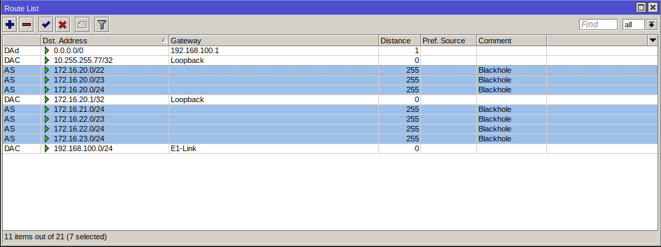

# RouterOS v7 BGP
______________
#### Este artigo tem o objetivo de tratar brevemente sobre as principais mudanças que ocorreram no BGP do sistema RouterOS v6 para RouterOS v7

- **BGP-Networking**
  - **RouterOS v6:** *Na versão 6 você consegue informar os prefixos originados por seu ASN através do caminho* **Routing > BGP > Networks**
  - **RouterOS v7:** *Já na versão 7 para informar os prefixos que serão originados por seu ASN, é necessário criar uma address list, contendo a respectiva quebra do ASN, segue o caminho:* **IP > Firewall > Address Lists.**
- **Anuncio dos prefixos**
  - **RouterOS v6:** *Na versão 6 é possível anunciar seu prefixo através da função __Synchronize__, sem que seja necessário adicionar de forma estática os prefixos que serão anunciados!*
  - **RouterOS v7:** *Já na versão 7, você precisa ter os prefixos que serão anunciados instalado em sua FIB de forma manual, pois não há mais a opção de Synchronize.*
- **Configuração de instância**
  - **RouterOS v6:** *Na versão 6 é possível configurar uma nova instância através do seguinte caminho:* **Routing > BGP > instances**
  - **RouterOS v7:** *Na versão 7 você pode configurar sua instância diretamente em um peer, ou caso prefira, também é possível criar um template e associar o mesmo no peer desejado, através do seguinte caminho:* **Routing > BGP > Templates**

- **Configuração de Filtros**
  - **RouterOS v6:** *Na versão 6 possuimos uma GUI que nos permite manipular nossos anúncios*
  - **RouterOS v7:** *Na versão 7 os filtros devem ser configurados através do __terminal__, ou através de uma __GUI__, porém via linha de comando.*  

- **Configuração de Peer BGP**
  - **RouterOS v6:** *Na versão 6 há o campo __Routing > BGP > Peers__ onde possibilita estabelecer uma sessão*
  - **RouterOS v7:** *Já na versão 7 há o campo __Routing > BGP > Connection__, onde permite que seja configurado uma nova sessão BGP*


__________
### <u>Exemplo de uma sessão BGP RouterOS v7</u>

##### Neste exemplo estaremos tratando sobre os seguintes assuntos:
- **Configurar Filtro BGP**
  - INPUT
    - Aplicar Local-Preference
  - OUTPUT
    - Aplicar Community
    - Aplicar AS-path
- **Configurar Conexão BGP**
  - Template
  - Networks
  - Peer BGP

##### <u>Filtros BGP (Input)</u>

```
/routing filter rule add chain=Link-Scorpion-IPv4-IN disabled=no rule="set bgp-local-pref 900; accept;"

/routing filter rule add chain=Link-Scorpion-IPv4-IN disabled=no rule="if(dst==0.0.0.0/0){accept;}"

/routing filter rule add chain=Link-Scorpion-IPv4-IN disabled=no rule="if(dst in 172.20.20.0/22 && dst-len in 22-23){reject;}"

/routing filter rule add chain=Link-Scorpion-IPv4-IN disabled=no rule="reject;"
```

##### <u>Filtros BGP (Output)</u>

```
Exemplos de anuncios BGP:

  /routing filter rule add chain=Link-Scorpion-IPv4-OUT disabled=no rule="if(dst == 172.16.20.0/22) {accept;}"
  /routing filter rule add chain=Link-Scorpion-IPv4-OUT disabled=no rule="if(dst == 172.16.20.0/23) {accept;}"
  /routing filter rule add chain=Link-Scorpion-IPv4-OUT disabled=no rule="if(dst == 172.16.22.0/23) {accept;}"
  /routing filter rule add chain=Link-Scorpion-IPv4-OUT disabled=no rule="if(dst == 172.16.20.0/24) {accept;}"
  /routing filter rule add chain=Link-Scorpion-IPv4-OUT disabled=no rule="if(dst == 172.16.21.0/24) {accept;}"
  /routing filter rule add chain=Link-Scorpion-IPv4-OUT disabled=no rule="if(dst == 172.16.22.0/24) {accept;}"
  /routing filter rule add chain=Link-Scorpion-IPv4-OUT disabled=no rule="if(dst == 172.16.23.0/24) {accept;}"

Através deste exemplo obtemos o mesmo resultado:

  /routing filter rule add chain=Link-Scorpion-IPv4-OUT disabled=no rule="if (dst in == 172.16.20.0/22 && dst-len in 22-24){accept;}"

Exemplo de um filtro com community:

  if(dst == 172.16.20.0/24) {set bgp-communities 777:666; accept;}

```

```
Exemplo de um anuncio com prepend (AS-Path) com mikrotik:

  if(dst == 172.16.21.0/24) {set bgp-path-prepend 3; accept;}

```


#### <u>Configurando Peer BGP</u>
<br>

- Networks<br>
  

- Blackhole<br>
  

- Peer BGP<br>
  <br><br>
  


__________
### Tabela de comandos úteis
______________
| Comando | Descrição |
| - | - |
| set bgp-med 15 | Alterar o peso das rotas para 15 |
| set bgp-local-pref 300 | Alterar a preferência das rotas para 300  |
| set bgp-ext-communities rt:327824:20 |	Inserir uma community estendida em um ou mais prefixos |
| set bgp-path-prepend 3 | Adicionar seu AS em uma rota BGP |
| set bgp-communities 777:666 | Inserir uma community em um ou mais prefixos |


### Operadores Lógico
__________
| Operador | Descrição |
| -   |   - |
| "&&" , "and"  | e   |
| \"\|\|" , "or" | ou  |
| "!" , "not" | não |
| "in" | em |


### Operadores Relacionais

| Operador | Descrição |
| - | - |
| "<" | Menor que |
| ">" | Maior que |
| "=" | Igual |
| "<="| Menor ou igual |
| ">="| Maior ou igual |
| "!="| Diferente de |


______________
### Fatos relevantes RouterOS 7

#### ```Para realizar todos os testes referenciados ao protocolo BGP foi utilizado a versão 7.6 virtualizada do sistema RouterOS```
- **BGP received routes:**
  - _Na versão 7.6 do routerOS, mesmo quando é negado os prefixos que serão aprendidos via eBGP, os mesmos continuam sendo listados na tabela de rotas com o status de inválido, segue o exemplo:_
  


- **BGP-Sessions:**
    - _No presente momento, caso seja utilizado a função de "refresh" ou “resend” para atualizar a tabela de rotas apreendidas via eBGP, o peer referenciado mudará o status para down e permanecerá neste enquanto o equipamento não for rebootado! Através dos testes realizados em laboratório com equipamentos **virtualizados** mesmo após desabilitar e habilitar a sessão BGP ou até mesmo alterando o status da interface, o peer não retornou para a condição de estabelecida!<br>Sendo assim, é recomendado **NÃO** utilizar este recurso da mikrotik._
    


_________
### Export operadora Scorpion

```
service timestamps debug datetime msec
service timestamps log datetime msec
no service password-encryption
!
hostname Borda-Scorpion
!
boot-start-marker
boot-end-marker
!
!
!
no aaa new-model
clock timezone EET 2 0
mmi polling-interval 60
no mmi auto-configure
no mmi pvc
mmi snmp-timeout 180
!         
!
!
!
!
!
!
!


!
!
!
!
no ip domain lookup
ip cef
no ipv6 cef
!
multilink bundle-name authenticated
!
!
!
!
!         
!
!
!
!
redundancy
!
!
!
!
!
!
!
!
!
!
!
!
!
!
!
interface Loopback1
 ip address 172.20.21.1 255.255.255.255
!         
interface Ethernet0/0
 ip address dhcp
!
interface Ethernet0/1
 no ip address
!
interface Ethernet0/1.366
 description Cliente-Sub-Zero
 encapsulation dot1Q 366
 ip address 172.20.20.1 255.255.255.252
!
interface Ethernet0/2
 no ip address
 shutdown
!
interface Ethernet0/3
 no ip address
 shutdown
!
router bgp 777
 bgp router-id 172.20.21.1
 bgp log-neighbor-changes
 neighbor 172.20.20.2 remote-as 333
 !
 address-family ipv4
  network 172.20.20.0 mask 255.255.252.0
  network 172.20.20.0 mask 255.255.254.0
  network 172.20.20.0 mask 255.255.255.0
  network 172.20.21.0 mask 255.255.255.0
  network 172.20.22.0 mask 255.255.254.0
  network 172.20.22.0 mask 255.255.255.0
  network 172.20.23.0 mask 255.255.255.0
  neighbor 172.20.20.2 activate
  neighbor 172.20.20.2 soft-reconfiguration inbound
  neighbor 172.20.20.2 route-map Cliente-Sub-Zero-IN in
  neighbor 172.20.20.2 route-map Cliente-Sub-Zero-OUT out
 exit-address-family
!
ip forward-protocol nd
!
!
no ip http server
no ip http secure-server
ip route 172.20.20.0 255.255.252.0 Null0
ip route 172.20.20.0 255.255.254.0 Null0
ip route 172.20.20.0 255.255.255.0 Null0
ip route 172.20.21.0 255.255.255.0 Null0
ip route 172.20.22.0 255.255.254.0 Null0
ip route 172.20.22.0 255.255.255.0 Null0
ip route 172.20.23.0 255.255.255.0 Null0
!
!
ip prefix-list Meu-Bloco seq 10 permit 172.20.20.0/22
ip prefix-list Meu-Bloco seq 20 permit 172.20.20.0/23
ip prefix-list Meu-Bloco seq 30 permit 172.20.22.0/23
ip prefix-list Meu-Bloco seq 40 permit 172.20.20.0/24
ip prefix-list Meu-Bloco seq 50 permit 172.20.21.0/24
ip prefix-list Meu-Bloco seq 60 permit 172.20.22.0/24
ip prefix-list Meu-Bloco seq 70 permit 172.20.23.0/24
!
route-map Cliente-Sub-Zero-IN permit 10
!
route-map Cliente-Sub-Zero-OUT permit 10
 match ip address prefix-list Meu-Bloco
!
!
!
control-plane
!         
!
!
!
!
!
!
!
line con 0
 logging synchronous
line aux 0
line vty 0 4
 login
 transport input none
!
!
end

```


_________

### Export operadora Raiden

```
## Last commit: 2023-01-09 19:18:41 UTC by root
version 14.1R4.8;
system {
    root-authentication {
        encrypted-password "$1$tyuCuQ4S$s/eOe/ZISPOvAuH2EACSw0"; ## SECRET-DATA
    }
    syslog {
        user * {
            any emergency;
        }
        file messages {
            any notice;
            authorization info;
        }
        file interactive-commands {
            interactive-commands any;
        }
    }
}
interfaces {
    ge-0/0/1 {
        description Cliente-Sub-Zero;
        unit 0 {
            family inet {               
                address 172.25.20.1/30;
            }
        }
    }
}
routing-options {
    static {
        route 172.25.20.0/22 discard;
        route 172.25.20.0/23 discard;
        route 172.25.22.0/23 discard;
        route 172.25.20.0/24 discard;
        route 172.25.21.0/24 discard;
        route 172.25.22.0/24 discard;
        route 172.25.23.0/24 discard;
    }
    autonomous-system 999;
}
protocols {
    bgp {
        group Cliente-Sub-Zero {
            type external;
            description Cliente-Sub-Zero;
            import Cliente-Sub-Zero-IN;
            export Cliente-Sub-Zero-OUT;
            peer-as 333;
            neighbor 172.25.20.2;
        }
    }
}
policy-options {
    policy-statement Cliente-Sub-Zero-IN {
        term 10 {
            then accept;
        }
    }
    policy-statement Cliente-Sub-Zero-OUT {
        term 10 {
            from {
                route-filter 172.25.20.0/22 exact;
            }
            then accept;
        }
        term 20 {
            from {
                route-filter 172.25.20.0/23 exact;
            }                           
            then accept;
        }
        term 30 {
            from {
                route-filter 172.25.22.0/23 exact;
            }
            then accept;
        }
        term 40 {
            from {
                route-filter 172.25.21.0/24 exact;
            }
            then accept;
        }
        term 50 {
            from {
                route-filter 172.25.22.0/24 exact;
            }
            then accept;
        }
        term 60 {
            then reject;
        }                               
    }
}

```

_________
#### Export Cliente-Sub-Zero

```
# jan/09/2023 21:05:12 by RouterOS 7.6
# software id =
#
/interface bridge add name=Loopback
/interface ethernet set [ find default-name=ether1 ] name=E1-Link-Scorpion
/interface ethernet set [ find default-name=ether2 ] name=E2-
/interface ethernet set [ find default-name=ether3 ] name=E3-Link-Raiden
/interface ethernet set [ find default-name=ether4 ] name=E4-
/interface vlan add interface=E1-Link-Scorpion name=vlan366-Link-Scorpion-IPv4 vlan-id=366
/interface wireless security-profiles set [ find default=yes ] supplicant-identity=MikroTik
/port set 0 name=serial0
/routing bgp template set default as=333 disabled=no router-id=172.16.20.1 routing-table=main
/ip address add address=10.255.255.77 interface=Loopback network=10.255.255.77
/ip address add address=172.16.20.1 interface=Loopback network=172.16.20.1
/ip address add address=172.20.20.2/30 interface=vlan366-Link-Scorpion-IPv4 network=172.20.20.0
/ip address add address=172.25.20.2/30 interface=E3-Link-Raiden network=172.25.20.0
/ip dhcp-client add interface=E1-Link-Scorpion
/ip firewall address-list add address=172.16.20.0/22 list=Meu-Bloco
/ip firewall address-list add address=172.16.20.0/23 list=Meu-Bloco
/ip firewall address-list add address=172.16.20.0/24 list=Meu-Bloco
/ip firewall address-list add address=172.16.22.0/24 list=Meu-Bloco
/ip firewall address-list add address=172.16.22.0/23 list=Meu-Bloco
/ip firewall address-list add address=172.16.21.0/24 list=Meu-Bloco
/ip firewall address-list add address=172.16.23.0/24 list=Meu-Bloco
/ip proxy access add dst-address=172.18.18.1 dst-host=google.com/xxt
/ip route add blackhole comment=Blackhole disabled=no distance=255 dst-address=172.16.20.0/22 gateway="" pref-src="" routing-table=main scope=30 suppress-hw-offload=no target-scope=10
/ip route add blackhole comment=Blackhole disabled=no distance=255 dst-address=172.16.20.0/23 gateway="" pref-src="" routing-table=main scope=30 suppress-hw-offload=no target-scope=10
/ip route add blackhole comment=Blackhole disabled=no distance=255 dst-address=172.16.20.0/24 gateway="" pref-src="" routing-table=main scope=30 suppress-hw-offload=no target-scope=10
/ip route add blackhole comment=Blackhole disabled=no distance=255 dst-address=172.16.21.0/24 gateway="" pref-src="" routing-table=main scope=30 suppress-hw-offload=no target-scope=10
/ip route add blackhole comment=Blackhole disabled=no distance=255 dst-address=172.16.22.0/24 gateway="" pref-src="" routing-table=main scope=30 suppress-hw-offload=no target-scope=10
/ip route add blackhole comment=Blackhole disabled=no distance=255 dst-address=172.16.22.0/23 gateway="" pref-src="" routing-table=main scope=30 suppress-hw-offload=no target-scope=10
/ip route add blackhole comment=Blackhole disabled=no distance=255 dst-address=172.16.23.0/24 gateway="" pref-src="" routing-table=main scope=30 suppress-hw-offload=no target-scope=10
/routing bgp connection add address-families=ip as=333 cisco-vpls-nlri-len-fmt=auto-bits connect=yes disabled=no input.filter=Link-Scorpion-IPv4-IN listen=yes local.address=172.20.20.2 .role=ebgp name=Link-Scorpion-IPv4 nexthop-choice=force-self output
.filter-chain=Link-Scorpion-IPv4-OUT .network=Meu-Bloco .no-client-to-client-reflection=yes remote.address=172.20.20.1/32 .as=777 .port=179 router-id=172.16.20.1 routing-table=main templates=default
/routing bgp connection add address-families=ip as=333 cisco-vpls-nlri-len-fmt=auto-bits connect=yes disabled=no input.filter=Link-Raiden-IPv4-IN listen=yes local.address=172.25.20.2 .role=ebgp name=Link-Raiden nexthop-choice=force-self output.filter-c
hain=Link-Raiden-IPv4-OUT .network=Meu-Bloco .no-client-to-client-reflection=yes remote.address=172.25.20.1/32 .as=999 .port=179 router-id=172.16.20.1 routing-table=main templates=default
/routing filter rule add chain=Link-Scorpion-IPv4-IN disabled=no rule="if(dst==0.0.0.0/0){accept;}"
/routing filter rule add chain=Link-Scorpion-IPv4-IN disabled=no rule="reject;"
/routing filter rule add chain=Link-Scorpion-IPv4-OUT disabled=yes rule="if(dst == 172.16.20.0/22) {accept;}\r\
    \nif(dst == 172.16.20.0/23) {accept;}\r\
    \nif(dst == 172.16.22.0/23) {accept;}\r\
    \nif(dst == 172.16.20.0/24) {set bgp-communities 777:666,777:123; accept;}\r\
    \nif(dst == 172.16.21.0/24) {accept;}\r\
    \nif(dst == 172.16.22.0/24) {accept;}\r\
    \nreject;\r\
    \nif(dst == 172.16.23.0/24) {accept;}\r\
    \n"
/routing filter rule add chain=Link-Scorpion-IPv4-OUT disabled=yes rule="if(dst == 172.16.20.0/22) {accept;}"
/routing filter rule add chain=Link-Scorpion-IPv4-OUT disabled=yes rule="if(dst == 172.16.20.0/23) {accept;}"
/routing filter rule add chain=Link-Scorpion-IPv4-OUT disabled=yes rule="if(dst == 172.16.22.0/23) {accept;}"
/routing filter rule add chain=Link-Scorpion-IPv4-OUT disabled=no rule="if(dst == 172.16.20.0/24) {set bgp-communities 777:666; accept;}"
/routing filter rule add chain=Link-Scorpion-IPv4-OUT disabled=yes rule="if(dst == 172.16.21.0/24) {accept;}"
/routing filter rule add chain=Link-Scorpion-IPv4-OUT disabled=yes rule="if(dst == 172.16.22.0/24) {accept;}"
/routing filter rule add chain=Link-Scorpion-IPv4-OUT disabled=yes rule="if(dst == 172.16.23.0/24) {accept;}"
/routing filter rule add chain=Link-Scorpion-IPv4-OUT disabled=yes rule="if (dst in 172.16.20.0/22 && dst-len in 22-24){accept;}"
/routing filter rule add chain=Link-Scorpion-IPv4-OUT disabled=no rule="reject;"
/routing filter rule add chain=Link-Raiden-IPv4-IN disabled=no rule="reject;"
/routing filter rule add chain=Link-Raiden-IPv4-OUT disabled=no rule="if(dst == 172.16.20.0/24) {set bgp-communities 777:666; accept;}\r\
    \n\r\
    \nif(dst == 172.16.21.0/24) {set bgp-path-prepend 3; accept;}"

```
