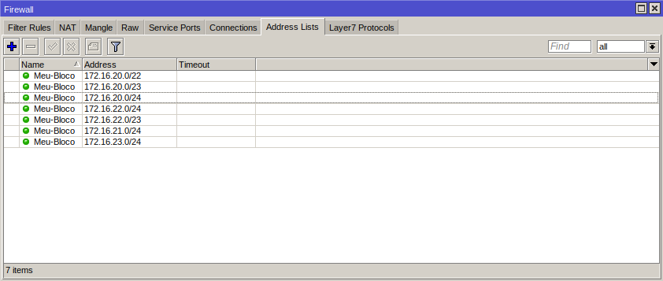

# RouterOS v7 BGP
______________
#### Este repositório tem o foco de explanar brevemente as principais mudanças que ocorreram no BGP do sistema RO'sv6 P/ RO'sv7.

- **BGP-Networking**
  - **RO's v6:** *Na versão 6 você consegue informar os prefixos originados por seu ASN através do caminho* **Routing > BGP > Networks**
  - **RO's v7:** *Já na versão 7 para informar os prefixos que serão originados por seu ASN, é necessário criar uma address list, contendo a respectiva quebra do ASN, segue o caminho:* **IP > Firewall > Address Lists.**
- **Anuncio dos Prefixos**
  - **RO's v6:** *Na versão 6 é possível anunciar seu prefixo através da função __Synchronize__, sem que seja necessário adicionar de forma estática os prefixos que serão anunciados!*
  - **RO's v7:** *Já na versão 7, você precisa ter os prefixos que serão anunciados instalado em sua FIB de forma manual, pois não há mais a opção de Synchronize.*
- **Configuração de instancia**
  - **RO's v6:** *Na versão 6 é possível configurar uma nova instancia através do seguinte caminho:* **Routing > BGP > instances**
  - **RO's v7:** *Na versão 7 você pode configurar sua instancia diretamente em um peer, ou caso prefira, também é possível criar um template e associar o mesmo no peer desejado, através do seguinte caminho:* **Routing > BGP > Templates**

- **Configuração de Filtros**
  - **RO's v6:** *Na versão 6 possuimos uma GUI que nos permite manipular nossos anúncios*
  - **RO's v7:** *Na versão 7 os filtros devem ser configurados através de __CLI__, semelhante a um script*  

- **Configuração de Peer BGP**
  - **RO's v6:** *Na versão 6 há o campo __Routing > BGP > Peers__ onde possibilita estabelecer uma sessão*
  - **RO's v7:** *Já na versão 7 há o campo __Routing > BGP > Connection__*


__________
### <u>Exemplo sessão BGP RO's V7</u>

##### Neste exemplo estaremos tratando sobre os seguintes temas:
- **Configurar Filtro BGP**
  - INPUT
    - Aplicar Local-Preference
  - OUTPUT
    - Aplicar community
    - Aplicar AS-path
- **Configurar Conexão BGP**
 - Template
 - Networks
  - Peer BGP

##### <u>Filtros BGP (Input )</u>

```

/routing filter rule add chain=Link-Scorpion-IPv4-IN disabled=no rule="set bgp-local-pref 900; accept;"

/routing filter rule add chain=Link-Scorpion-IPv4-IN disabled=no rule="if(dst==0.0.0.0/0){accept;}"

/routing filter rule add chain=Link-Scorpion-IPv4-IN disabled=no rule="if(dst in 172.20.20.0/22 && dst-len in 22-23){reject;}"

/routing filter rule add chain=Link-Scorpion-IPv4-IN disabled=no rule="reject;"

```

##### <u>Filtros BGP (Output )</u>

```
Exemplos de anuncios BGP:

  /routing filter rule add chain=Link-Scorpion-IPv4-OUT disabled=no rule="if(dst == 172.16.20.0/22) {accept;}"
  /routing filter rule add chain=Link-Scorpion-IPv4-OUT disabled=no rule="if(dst == 172.16.20.0/23) {accept;}"
  /routing filter rule add chain=Link-Scorpion-IPv4-OUT disabled=no rule="if(dst == 172.16.22.0/23) {accept;}"
  /routing filter rule add chain=Link-Scorpion-IPv4-OUT disabled=no rule="if(dst == 172.16.20.0/24) {accept;}"
  /routing filter rule add chain=Link-Scorpion-IPv4-OUT disabled=no rule="if(dst == 172.16.21.0/24) {accept;}"
  /routing filter rule add chain=Link-Scorpion-IPv4-OUT disabled=no rule="if(dst == 172.16.22.0/24) {accept;}"
  /routing filter rule add chain=Link-Scorpion-IPv4-OUT disabled=no rule="if(dst == 172.16.23.0/24) {accept;}"

Através deste Exemplo obtemos o mesmo resultado:

  /routing filter rule add chain=Link-Scorpion-IPv4-OUT disabled=no rule="if (dst in == 172.16.20.0/22 && dst-len in 22-24){accept;}"

Exemplo de filtro com community:

  if(dst == 172.16.20.0/24) {set bgp-communities 777:666; accept;}

```

```
Exemplo aplicando prepend (AS-Path) com mikrotik:

  if(dst == 172.16.21.0/24) {set bgp-path-prepend 3; accept;}

```


#### <u>Configurando Peer BGP</u>
<br>

- networks
  

- BlackHole
  

- Peer BGP
  
  


__________
### Tabela de comandos úteis
______________
| Comando | Descrição |
| - | - |
| dst-len | Lorem ipsum |
| bgp-path-len | Quantidade atual de AS-Path |
| bgp-input-local-as |	Lorem ipsum |
| bgp-input-remote-as	| Lorem ipsum |
| bgp-output-local-as | Lorem ipsum |
| bgp-output-remote-as	| Lorem ipsum |
| ospf-metric	| Lorem ipsum|
| ospf-tag	| Lorem ipsum |
| rip-metric	| Lorem ipsum |
| rip-tag	| Lorem ipsum |

### Operadores Lógico
__________
| Operador | Descrição |
| - | - |
| && | - |
| \|\| | - |
| not | - |


______________

### Mudanças BGP RO's V7

- Configurar networks
- Configurar BlackHole
- Configurar Local AS
- Configurar Filtros (Input - Output)
  - Aplicar community
  - Aplicar AS-path
  - Aplicar Local-Preference
- Configurar peer EBGP  


### Fatos interessantes RouterOS 7

#### ```No presente momento onde este artigo está sendo escrito, estamos utilizando a versão 7.6 do RouterOS```
- **BGP Received routes:**
  - _Na versão 7.6 do routerOS, mesmo quando é negado os prefixos que serão apreendidos via EBGP, os mesmos são listados na tabela de rotas, segue exemplo:_
  


- **BGP-Sessions:**
    - _No presente momento, caso seja utilizado o serviço de "Refresh" para atualizar a tabela de rotas de rotas apreendidas via EBGP, o peer referênciado mudará o status para down e permanecera neste status, enquanto o equipamento não for rebootado!<br>Sendo assim, é recomendado **não** utilizar este recurso da mikrotik._


_________
### Export Operadora Scorpion

```
service timestamps debug datetime msec
service timestamps log datetime msec
no service password-encryption
!
hostname Borda-Scorpion
!
boot-start-marker
boot-end-marker
!
!
!
no aaa new-model
clock timezone EET 2 0
mmi polling-interval 60
no mmi auto-configure
no mmi pvc
mmi snmp-timeout 180
!         
!
!
!
!
!
!
!


!
!
!
!
no ip domain lookup
ip cef
no ipv6 cef
!
multilink bundle-name authenticated
!
!
!
!
!         
!
!
!
!
redundancy
!
!
!
!
!
!
!
!
!
!
!
!
!
!
!
interface Loopback1
 ip address 172.20.21.1 255.255.255.255
!         
interface Ethernet0/0
 ip address dhcp
!
interface Ethernet0/1
 no ip address
!
interface Ethernet0/1.366
 description Cliente-Sub-Zero
 encapsulation dot1Q 366
 ip address 172.20.20.1 255.255.255.252
!
interface Ethernet0/2
 no ip address
 shutdown
!
interface Ethernet0/3
 no ip address
 shutdown
!
router bgp 777
 bgp router-id 172.20.21.1
 bgp log-neighbor-changes
 neighbor 172.20.20.2 remote-as 333
 !
 address-family ipv4
  network 172.20.20.0 mask 255.255.252.0
  network 172.20.20.0 mask 255.255.254.0
  network 172.20.20.0 mask 255.255.255.0
  network 172.20.21.0 mask 255.255.255.0
  network 172.20.22.0 mask 255.255.254.0
  network 172.20.22.0 mask 255.255.255.0
  network 172.20.23.0 mask 255.255.255.0
  neighbor 172.20.20.2 activate
  neighbor 172.20.20.2 soft-reconfiguration inbound
  neighbor 172.20.20.2 route-map Cliente-Sub-Zero-IN in
  neighbor 172.20.20.2 route-map Cliente-Sub-Zero-OUT out
 exit-address-family
!
ip forward-protocol nd
!
!
no ip http server
no ip http secure-server
ip route 172.20.20.0 255.255.252.0 Null0
ip route 172.20.20.0 255.255.254.0 Null0
ip route 172.20.20.0 255.255.255.0 Null0
ip route 172.20.21.0 255.255.255.0 Null0
ip route 172.20.22.0 255.255.254.0 Null0
ip route 172.20.22.0 255.255.255.0 Null0
ip route 172.20.23.0 255.255.255.0 Null0
!
!
ip prefix-list Meu-Bloco seq 10 permit 172.20.20.0/22
ip prefix-list Meu-Bloco seq 20 permit 172.20.20.0/23
ip prefix-list Meu-Bloco seq 30 permit 172.20.22.0/23
ip prefix-list Meu-Bloco seq 40 permit 172.20.20.0/24
ip prefix-list Meu-Bloco seq 50 permit 172.20.21.0/24
ip prefix-list Meu-Bloco seq 60 permit 172.20.22.0/24
ip prefix-list Meu-Bloco seq 70 permit 172.20.23.0/24
!
route-map Cliente-Sub-Zero-IN permit 10
!
route-map Cliente-Sub-Zero-OUT permit 10
 match ip address prefix-list Meu-Bloco
!
!
!
control-plane
!         
!
!
!
!
!
!
!
line con 0
 logging synchronous
line aux 0
line vty 0 4
 login
 transport input none
!
!
end

```


_________

### Export Operadora Raiden

```
## Last commit: 2023-01-09 19:18:41 UTC by root
version 14.1R4.8;
system {
    root-authentication {
        encrypted-password "$1$tyuCuQ4S$s/eOe/ZISPOvAuH2EACSw0"; ## SECRET-DATA
    }
    syslog {
        user * {
            any emergency;
        }
        file messages {
            any notice;
            authorization info;
        }
        file interactive-commands {
            interactive-commands any;
        }
    }
}
interfaces {
    ge-0/0/1 {
        description Cliente-Sub-Zero;
        unit 0 {
            family inet {               
                address 172.25.20.1/30;
            }
        }
    }
}
routing-options {
    static {
        route 172.25.20.0/22 discard;
        route 172.25.20.0/23 discard;
        route 172.25.22.0/23 discard;
        route 172.25.20.0/24 discard;
        route 172.25.21.0/24 discard;
        route 172.25.22.0/24 discard;
        route 172.25.23.0/24 discard;
    }
    autonomous-system 999;
}
protocols {
    bgp {
        group Cliente-Sub-Zero {
            type external;
            description Cliente-Sub-Zero;
            import Cliente-Sub-Zero-IN;
            export Cliente-Sub-Zero-OUT;
            peer-as 333;
            neighbor 172.25.20.2;
        }
    }
}
policy-options {
    policy-statement Cliente-Sub-Zero-IN {
        term 10 {
            then accept;
        }
    }
    policy-statement Cliente-Sub-Zero-OUT {
        term 10 {
            from {
                route-filter 172.25.20.0/22 exact;
            }
            then accept;
        }
        term 20 {
            from {
                route-filter 172.25.20.0/23 exact;
            }                           
            then accept;
        }
        term 30 {
            from {
                route-filter 172.25.22.0/23 exact;
            }
            then accept;
        }
        term 40 {
            from {
                route-filter 172.25.21.0/24 exact;
            }
            then accept;
        }
        term 50 {
            from {
                route-filter 172.25.22.0/24 exact;
            }
            then accept;
        }
        term 60 {
            then reject;
        }                               
    }
}

```
